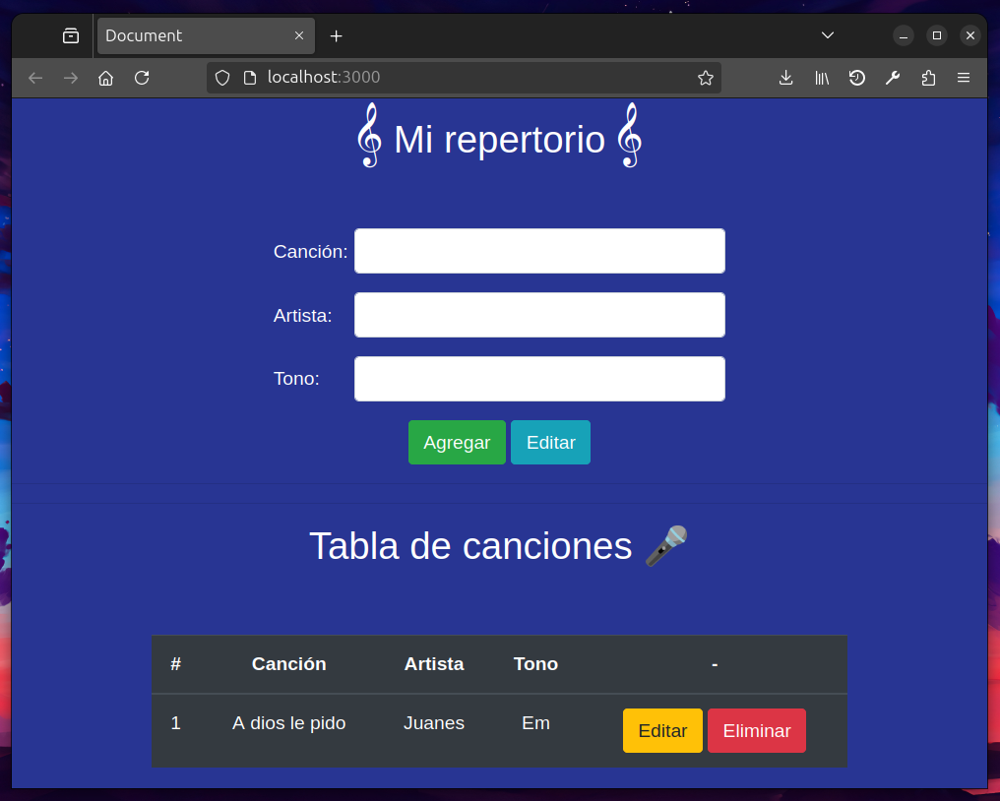

# Desafio Mi Repertorio

En este desafío validaremos nuestros conocimientos sobre Levantar un servidor con
conexión a PostgreSQL, Insertar registros, Consultar registros, Actualizar registros y Eliminar
registros.

### Para inicializar el programa se requiere:

1. Instalar las dependencias usadas con el comando `npm i`.
2. Se requiere crear una base de datos en postgres usando las consultas en la carpeta SQL.
3. Crear un archivo `.env` con las variables de entorno necesarias (PORT, DB_USER, DB_PASSWORD, DB_HOST, DB_PORT, DB_NAME).
4. Se requiere ejecutar el programa con el comando `npm run dev`.

### Ejemplo de uso

## Josué Gallardo - g68 Bootcamp Talento Digital - Desafío Latam
